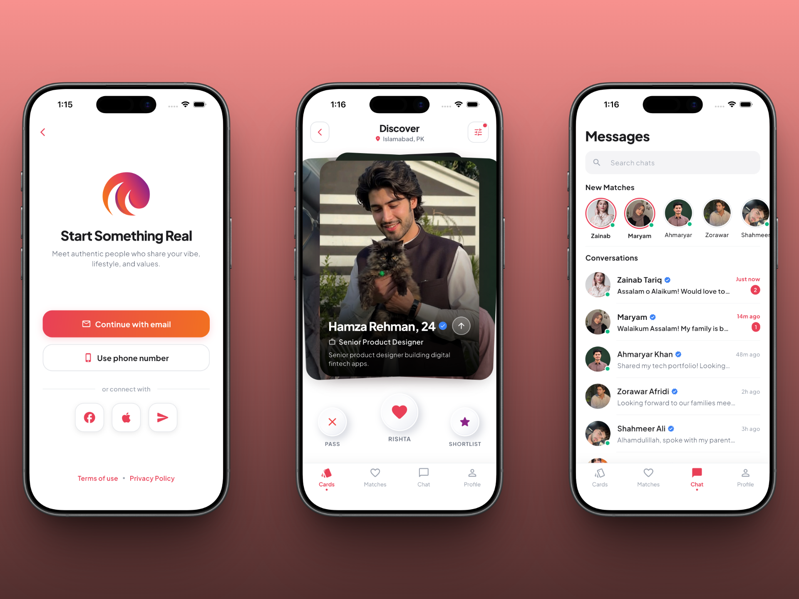

<div align="center">
  

  # 💍 Muslim Matrimonial & Dating App UI Kit

  **A modern, premium, and pixel-perfect Islamic Matrimonial & Dating App UI built with Flutter.**  
  Crafted for halal matchmaking, family-centric rishtas, and serious marriage connections with fluid micro-animations, 3D neumorphic swipe controls, and clean modular architecture.

  [](https://flutter.dev)
  [](https://dart.dev)
  [](LICENSE)
  [](https://flutter.dev)
</div>

---

## 🌟 Key Highlights

- 💍 **Halal Matrimonial Concept**: Tailored for serious Muslim marriage seekers with deen-focused bios, family values, and authentic matrimonial prompts.
- 🎴 **3D Neumorphic Swipe Deck**: Interactive card deck with side-peek previews and live stamp feedback (`SEND RISHTA`, `PASS`, `SHORTLIST`).
- 🔍 **Detailed Candidate Profiles**: Rich profile views featuring full Islamic bios, profession details, location tags, interests, and Hinge-style prompt cards.
- 🎯 **Advanced Preference Filters**: Clean bottom sheet for tailoring age range, distance, education, and lifestyle criteria.
- ❤️ **Matches Hub**: Organized by "Today" and "Yesterday" with verified badges and instant chat triggers.
- 💬 **Stories & Messaging UI**: Instagram-style story tray with progress indicators, search filtering, and interactive chat dialogs.
- 🚀 **Onboarding & Auth Flow**: 3-step carousel focused on privacy and modesty, followed by social login and multi-step profile setup.
- 📱 **Clean Modular Architecture**: Separation of features (`explore`, `matches`, `chats`, `profile`, `auth`, `onboarding`) with unified `IndexedStack` navigation.

---

## 📱 App Modules & Screens

| Module | Screen / Component | Description |
| :--- | :--- | :--- |
| **Onboarding** | `OnboardingScreen` | 3-step carousel highlighting serious intentions, privacy, and verified profiles. |
| **Authentication** | `SignupScreen` | Welcoming auth screen with Google, Apple, and social sign-in options. |
| **Profile Setup** | `ProfileDetailsScreen` & `PassionsScreen` | Step-by-step onboarding for personal details, gender, and interest chips. |
| **Explore (Deck)** | `ExplorePeopleScreen` | Swipeable candidate stack with custom stamps, 3D buttons, and tap-to-expand details. |
| | `CandidateProfileScreen` | Full candidate profile with prompt Q&As, bio, and multi-photo gallery grid. |
| | `ExploreFilterModal` | Modal sheet to customize distance, age, and discovery preferences. |
| **Matches** | `MatchesScreen` | Match grid organized by time with quick pass/like actions and detail modals. |
| **Chats & Stories** | `ChatsScreen` | Conversation list with search bar, online status, and horizontal story avatars. |
| | `StoryViewerModal` | Animated timed story viewer with quick reaction and reply bar. |
| | `ChatDetailModal` | Full messaging interface with chat bubble styling and input controls. |
| **User Profile** | `ProfileViewScreen` | Personal profile view, photo gallery, discovery preferences, and settings. |

---

## 🎨 Color Palette & Typography

- **Primary Accent**: `#E94057` (Romantic Rose)
- **Primary Gradient**: `#E94057` ➔ `#8A2387`
- **Background**: `#FFFFFF` (Pure Crisp White)
- **Cards & Surfaces**: `#F4F4F6` & `#FFFFFF`
- **Typography**: [Plus Jakarta Sans](https://fonts.google.com/specimen/Plus+Jakarta+Sans) via Google Fonts

---

## 🚀 Quick Start

### 1. Clone & Install
```bash
git clone https://github.com/codexahmar/Marriage-App-UI-Kit
cd Marriage-App-UI-Kit
flutter pub get
```

### 2. Run the App
```bash
flutter run
```

---

## 🔌 Backend Integration

This template is built as a **pure frontend UI kit** with mock data cleanly isolated in model classes. You can easily connect:
- **Firebase**: Replace static model lists with Firestore streams and Firebase Auth.
- **Supabase / REST APIs**: Connect endpoints directly using `http` or `dio`.

---

<div align="center">
  <sub>Designed & Developed with ❤️ using Flutter</sub>
</div>
